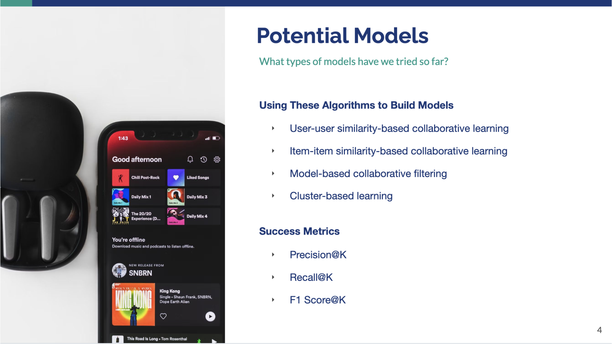

# 🎵 Spotify Music Recommendation System

This project develops a recommendation system to predict and recommend the top 10 songs for Spotify users based on their listening history and preferences. The solution leverages advanced machine learning techniques to enhance user experience through highly personalized recommendations.

## 🌟 Project Overview
<ul>
  <li>
    <b>Dataset:</b>
    <ul>
      <li>Historical user play history and song metadata, filtered to <b>3156 unique users</b>, <b>9998 unique songs</b>, and <b>240,438 total rows</b>.</li>
    </ul>
  </li>
  <li>
    <b>Tech Stack:</b>
    <ul>
      <li><b>Programming:</b> PySpark (Data Curation), Python (Model Building)</li>
      <li><b>Libraries:</b> Pandas, NumPy, Scikit-learn, Surprise, Pickle, Plotly, Seaborn</li>
      <li><b>Algorithms:</b>
        <ul>
          <li>Collaborative filtering (user-user, item-item)</li>
          <li>Model-based collaborative filtering (e.g., SVD)</li>
          <li>Hybrid models combining multiple algorithms</li>
        </ul>
      </li>
    </ul>
  </li>
  <li>
    <b>My Role:</b>
    <ul>
      <li>As a <b>Data Scientist</b>, I spearheaded data preprocessing and feature engineering</li>
      <li>Built and evaluated baseline and advanced recommendation models</li>
      <li>Optimized the hybrid model for precision, recall, and F1 score</li>
    </ul>
  </li>
</ul>

## 🔧 Data Preparation
- Merged and filtered the user play history and song metadata by using the following filtering criteria:
  - Users with at least 90 songs played  
  - Songs listened to by at least 120 users  
  - Songs with no more than 5 play counts  
- Split the dataset into:
  - **Training set (60%)**: 240,438 rows  
  - **Test set (40%)**: 160,292 rows

 <!-- Replace with the correct image path -->

## 🔍 Exploratory Data Analysis (EDA)
- Explored user behavior, song popularity trends, and listening preferences  
- Addressed missing data and ensured feature integrity
- Identified patterns in recall values across different K values. 

## ⚙️ Model Development and Optimization
### Potential Models
What types of model have we tried so far?
- **Collaborative Filtering**: User-user and item-item similarity  
- **Model-Based Collaborative Filtering**: SVD and matrix factorization  
- **Cluster-Based Learning**: Grouped users and items into clusters  
- **Hybrid Models**: Combined multiple approaches for improved results
   
 <!-- Replace with the correct image path -->
 <!-- Replace with the correct image path -->
 <!-- Replace with the correct image path -->
 <!-- Replace with the correct image path -->

## 📊 Results and Visualizations
### Evaluating the Hybrid Model
- Combined the **tuned user-user model** and the **tuned item-item model**  
- Achieved the best performance with precision, recall, and F1 scores
- Models showed similar RMSE values, but the hybrid model provided a more balanced recommendation system.  

 

## 🧩 Limitations and Recommendations
### Limitations
1. Missing timestamps restrict new vs. returning user segmentation  
2. Lack of song metadata (e.g., genre) limits content-based recommendations  

### Recommendations
1. Collect additional data, such as song genres and user timestamps  
2. Experiment with varying K values for hybrid models  
3. Use A/B testing to validate real-world recommendation performance  

## 📂 Repository Structure
The repository is structured as follows:

- **`notebook/`**: Contains a Jupyter notebook for exploratory data analysis (EDA), feature engineering, model building, and insights.
- **`report/`**: Includes the executive summary report and visualizations for project results.

💡 *To explore the project's implementation details, check out the Jupyter notebooks in the `notebook/` directory. For a detailed overview, including insights and recommendations, refer to the executive summary in the `report/` directory.*

